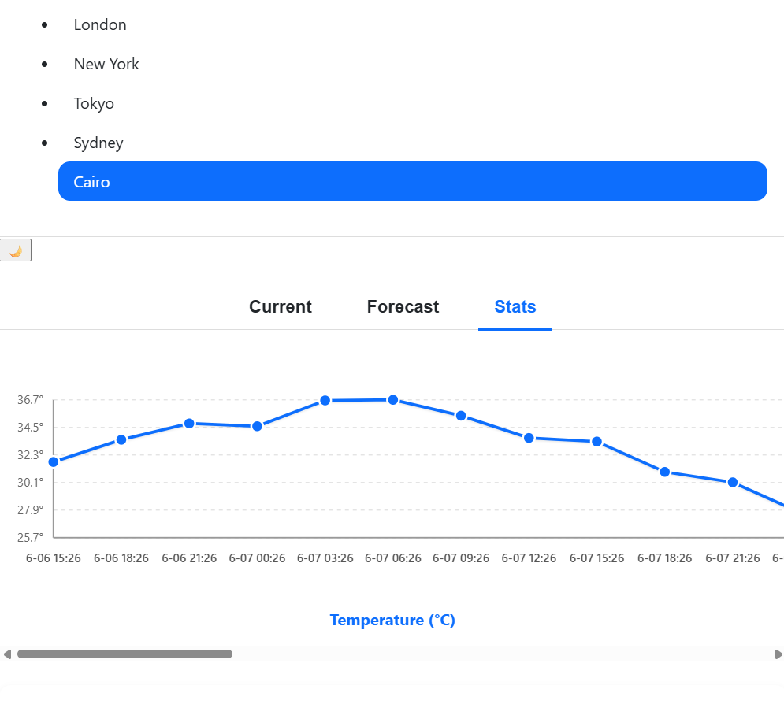
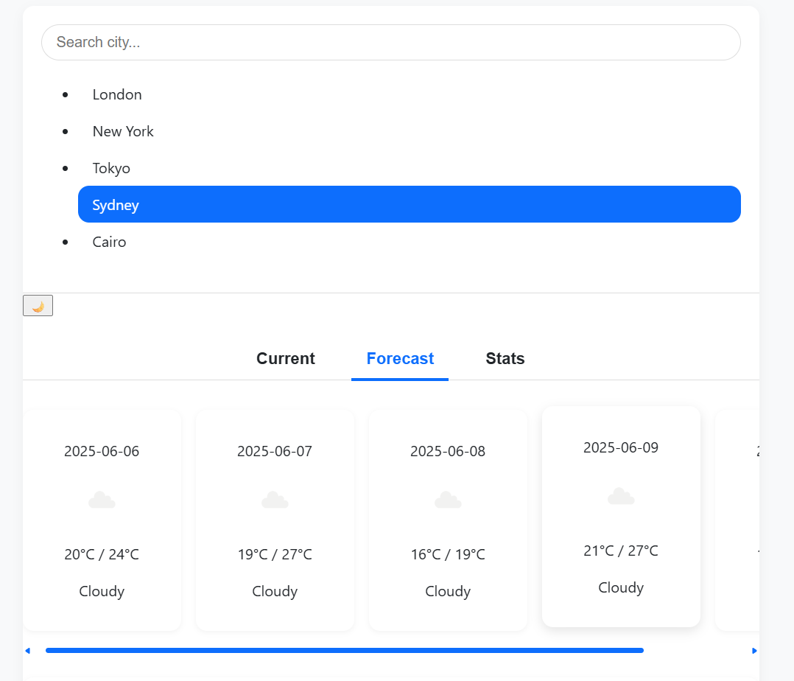
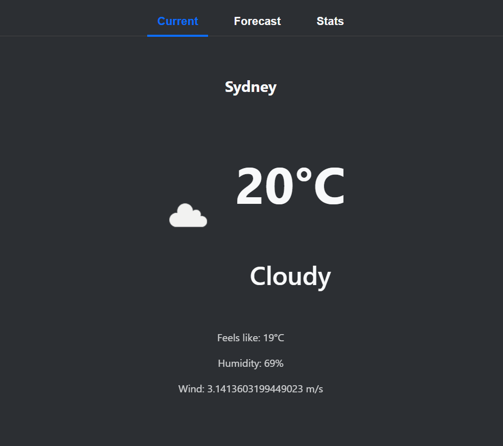

# Weather Dashboard Widget

A standalone React application that displays and analyzes weather data across multiple cities. Demonstrates component architecture, state management, and data visualization using OpenWeatherMap API.

---

## Features

- Select cities (London, New York, Tokyo, Sydney, Cairo) with search/filter
- Current weather display with icons and detailed info
- 5-day forecast displayed as cards
- Temperature visualization via custom SVG charts (no chart libraries)
- Configurable settings panel (units, refresh rate, display options)
- Dark/light mode with smooth theme toggle
- Tab system to switch between Current Weather, Forecast, and Statistics views
- Error handling with ErrorBoundary component
- Custom hooks and reducer pattern for state management
- Debounce and throttle utilities for optimal API calls

---

## Demo





---

## Installation

1. Clone the repo:

   ```bash
   git clone https://github.com/muzaffarovs/weather-dashboard-widget.git
   cd weather-dashboard-widget

   ```

2. Install dependencies:

```
 npm install
 # or
 yarn install

```

3. Obtain an OpenWeatherMap API key:

   Sign up at OpenWeatherMap and get a free API key.

4. Create .env file in project root with your API key:

   REACT_APP_OPENWEATHER_API_KEY=your_api_key_here

# RUNNING THE APP

    npm start
    # or
    yarn start

    The app will run at http://localhost:5173/.

# TESTING

Run unit tests with:

    npm test
    # or
    yarn test

## Tests include:

    Custom hook useWeatherData
    Temperature conversion functions
    Debounce/throttle utilities
    Snapshot tests for UI components

# PROJECT STRUCTURE

        src/
    ├── components/         # React components
    ├── hooks/              # Custom React hooks
    ├── reducers/           # Reducer logic and state management
    ├── utils/              # Utility functions (debounce, throttle, data transforms)
    ├── styles/             # CSS/SCSS files
    ├── App.tsx             # Main app component
    └── index.tsx           # Entry point

# COMPONENT OVERVIEW

    WeatherWidget: Main container managing tabs and overall state
    CitySelector: Searchable dropdown for city selection
    WeatherDisplay: Shows current weather info with icons
    ForecastList: Displays 5-day forecast cards
    DataVisualization: Custom SVG temperature chart
    SettingsPanel: User-configurable settings (units, refresh rate)
    ErrorBoundary: Catches and displays errors gracefully

# STATE MANAGEMENT

    useWeatherData custom hook for fetching and transforming weather data
    Reducer pattern with actions: FETCH_WEATHER, CHANGE_CITY, TOGGLE_UNIT, SET_ERROR, CLEAR_ERROR
    Theme context for dark/light mode toggling

# PERFORMANCE & UTILITIES

    Throttling of API calls to max 1 per 5 seconds
    Debounced city search input (300ms delay)
    Data transformations for temperature conversions, daily averages, min/max values

# STYLING

    Responsive design: fixed 800px width on desktop, fluid layout on mobile
    Dark/light mode with specific color palette:
      -> Light: #f8f9fa (background), #212529 (text), #0d6efd (accent)
      -> Dark: #212529 (background), #f8f9fa (text), #0d6efd (accent)
    Smooth CSS transitions on city/tab changes

# CONTRIBUTING

    Feel free to open issues or submit pull requests. Please follow standard best practices for code style and testing.

# LICENCE

    MIT License © RAJAB
